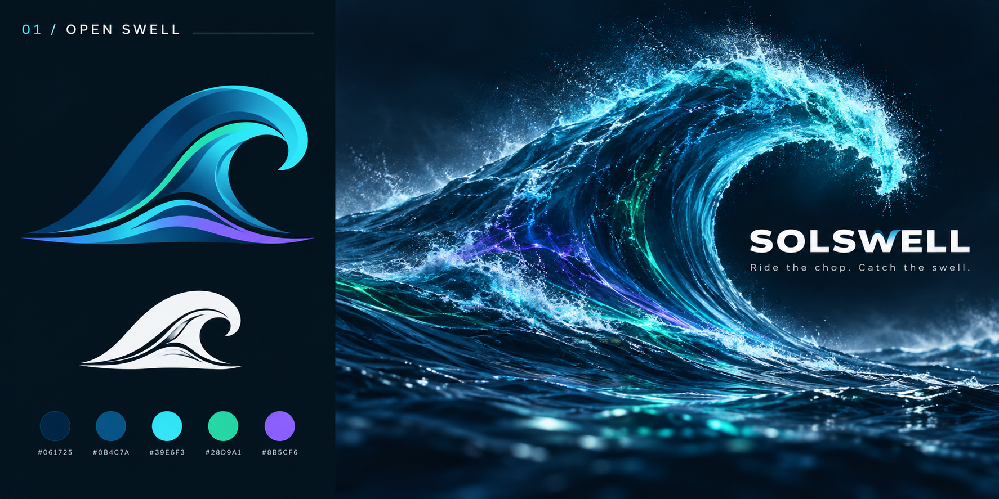
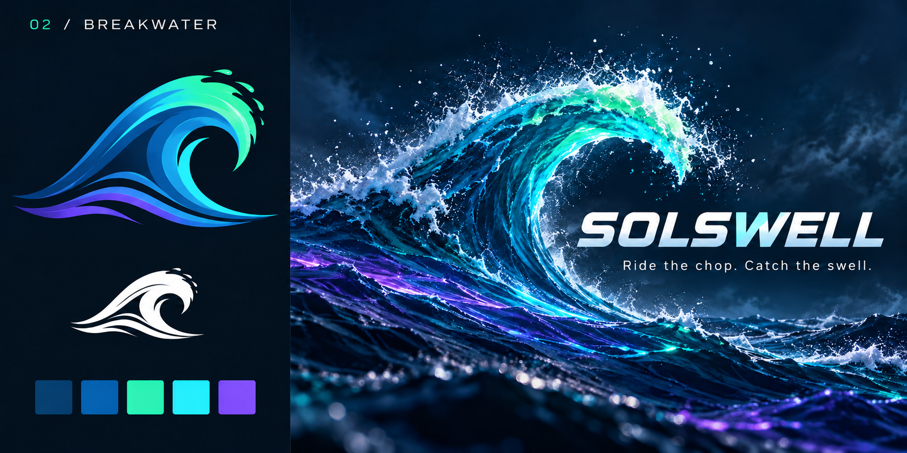
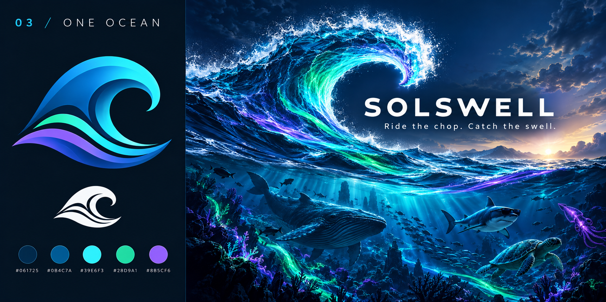

# SOLSWELL preliminary master-wave brand review

Status: concepts for review, not approved production assets. No website or X changes are included.

Slogan: **Ride the chop. Catch the swell.**

## Review objective

Assess three distinct directions for SOLSWELL's master identity. The first read must be a side-view ocean swell; the second should imply rising market momentum through the water's structure and currents. SOLSWELL represents the whole Solana ocean. Creatures are supporting archetypes, not the master mark.

Please assess:

- Ocean-first recognition and subtle momentum, without literal financial graphics.
- Distinctiveness, premium quality and suitability for the broader ecosystem.
- Silhouette legibility at small circular avatar sizes and in one color.
- Consistency between the symbol, wordmark and hero art.
- Absence of official Solana branding or affiliation cues.
- What needs simplification before a final vector logo is drawn.

Return a ranked recommendation with concise strengths, weaknesses and specific refinements. Do not treat any direction as approved, publish changes, generate replacement artwork, or implement a website redesign.

## Focused profile refinement — current candidate

The current candidate develops **Open Swell** into a square profile/token image. The natural side-view wave remains primary; an uneven sequence of translucent green candlesticks follows the rising back to imply swelling price action. Foam is intentionally limited to the breaking lip and base, while the rising back remains clean water. A quiet blue-gray mist creates separation without leaving the green/cyan/purple brand palette.

Please review this candidate specifically for:

- Wave-first recognition before the market reference.
- Whether the candlestick sequence reads as rising momentum without feeling pasted on.
- Natural foam placement and the clean rising waterline.
- Circular-avatar and small token-icon legibility.
- Whether the cool mist supplies enough contrast without becoming dramatic.
- Remaining cellular or synthetic-looking water texture at full size.

The exact final background-edit prompt is preserved in [COOL-MIST-V8-PROMPT.md](COOL-MIST-V8-PROMPT.md). This remains a review candidate, not a live website, X, token-launch or production asset update.

### Production-refinement review package

The Cool Mist candidate has now received a focused water-realism refinement with exact 128px, 64px and 32px circular-crop tests plus an original/refined comparison. Review the complete [profile-refinement package](profile-refinement/README.md). This update remains review-only and must not be merged or deployed without visual approval.

The latest candidate adds more circular breathing room while preserving the wave and candles. Review the [profile-refinement v2 package](profile-refinement-v2/README.md) for the updated full-resolution PNG, exact size tests and prior-refined/v2 comparison.

The final polish candidate cleans only the luminous current ribbons for smoother large-scale edges. Review the [profile-refinement v3 package](profile-refinement-v3/README.md) for the updated PNG, zoomed current-line comparison and circular previews.

The latest candidate tightens the lower framing to remove excess out-of-focus foreground while preserving the wave, candles and circular buffer. Review the [profile-refinement v4 package](profile-refinement-v4/README.md).

The first master-banner candidate extends the Cool Mist identity into a wide ecosystem scene with a dominant swell, subtle distant swells and atmospheric underwater archetypes. Review the [master-banner package](master-banner-2026-10-09/README.md).

The latest master-banner refinement adds natural longitudinal swell bands that run along the wave's length, following real ocean flow rather than reading as graphic stripes. Review the V2 files in the [master-banner package](master-banner-2026-10-09/README.md).

The V3 composition looks down the swell's length: the main SOLANA archetype folds into an inward crash, a smaller RAYDIUM echo follows behind, and the inner mist carries only a vague non-official wave-glyph impression. Review the V3 files in the [master-banner package](master-banner-2026-10-09/README.md).

The V4 refinement makes the main mist read as a ghosted S, brings the secondary swell closer with its own candles and R mark, and smooths the right-hand chop. Review the V4 files in the [master-banner package](master-banner-2026-10-09/README.md).

The V5 identity pass aligns the three mist bars into one parallel Solana-style slant and frames them inside the swell's inner curve. Review the V5 files in the [master-banner package](master-banner-2026-10-09/README.md).

## 1. Open Swell

## 2. Breakwater

## 3. One Ocean

Read [the complete direction brief](BRAND-DIRECTIONS.md) and [the exact generation prompts](GENERATION-PROMPTS.md). These raster boards explore direction; fine cuts and typography are not production-ready vector artwork.
