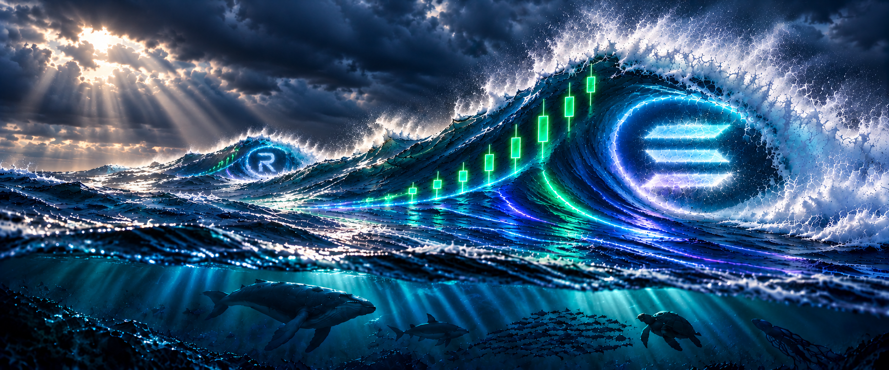

# SOLSWELL clean master banner — V12

This is a fresh master-banner regeneration, created from the approved SOLSWELL direction rather than an upscale or patch of the previous source.

## Review points

- The dominant, natural central swell remains the hero.
- The three pale inner-curve bars stay horizontal and framed inside the main wave.
- The distant left swell now contains a subtle but readable R-shaped water-mist reference.
- Each green candle body and wick is upright relative to the horizon; the sequence rises across the wave without individual candles leaning with it.
- Underwater silhouettes remain atmospheric and secondary.

## Files

- `solswell-master-banner-v12-r-and-upright-candles.png` — clean regenerated master, 1944 × 809
- `solswell-master-banner-v12-website-hero-1920x900.png` — derived website hero crop
- `solswell-master-banner-v12-x-1500x500.png` — derived X banner crop
- `GENERATION-PROMPT.md` — exact constrained regeneration prompt

No website, live branding, X profile, or approved V4 profile image was changed.
