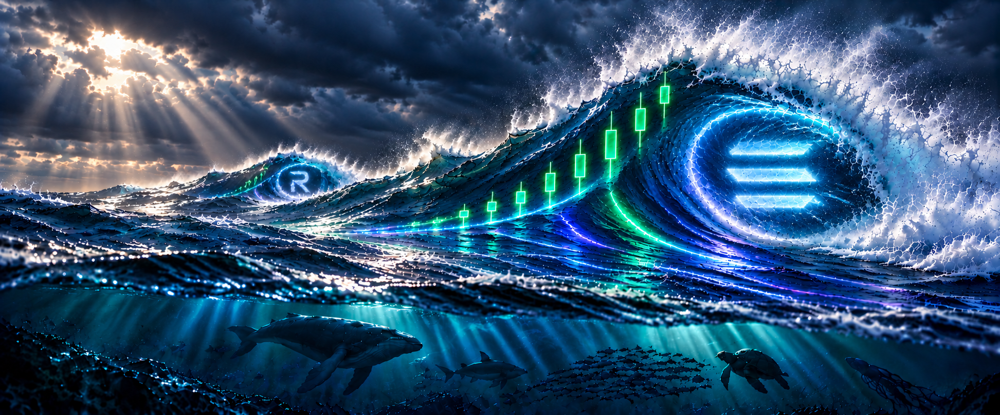

# SOLSWELL clean master banner — V13 smooth barrel

V13 is a tightly scoped refinement of the V12 review candidate. It replaces the faceted polygon-like water pattern around the three inner mist bars with smooth, natural barrel water.

## Preserved

- Dominant main swell, crest and framing
- Three horizontal inner-curve mist bars
- Distant left R-shaped mist reference
- Upright green candles and their rising sequence
- Current trails, storm lighting and underwater ecosystem silhouettes

## Files

- `solswell-master-banner-v13-smooth-barrel.png` — master, 1945 × 809
- `solswell-master-banner-v13-website-hero-1920x900.png` — website hero crop
- `solswell-master-banner-v13-x-1500x500.png` — X banner crop
- `SMOOTH-BARREL-PROMPT.md` — exact limited edit instruction

The approved V4 profile image, V9, V12 and all live branding remain unchanged.
