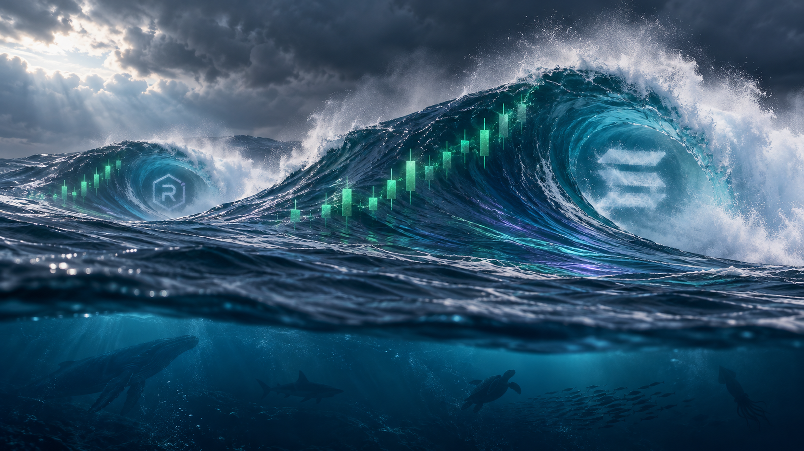
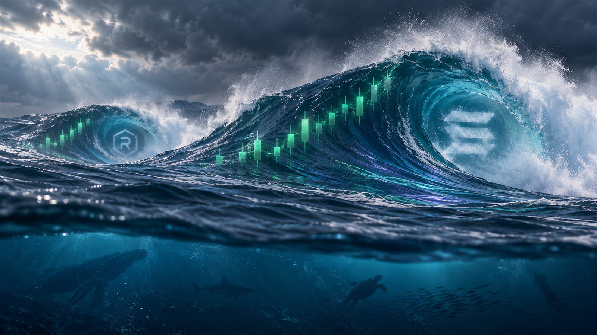
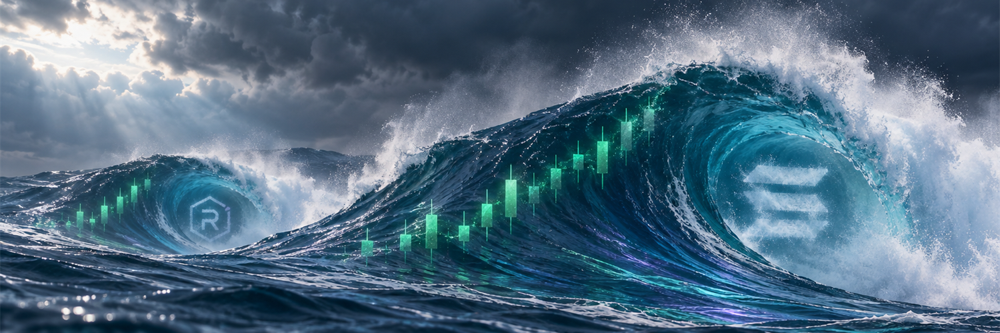

# SOLSWELL V14 — fresh natural-water rebuild (review only)

## What changed

Generated a new scene from a textual composition specification, without feeding the faceted previous raster back into the generator. The water now reads as flowing liquid with smoother barrel walls, restrained currents, and fine crest spray instead of the prior prominent polygon mesh.

The composition concept remains: dominant right swell, smaller left RAY swell, upright rising candles on both, pale mist symbols, storm sky and secondary underwater ecosystem. This is a rebuild, not pixel-identical preservation of V9.

## Files and real dimensions

- Master: **1672 × 941** PNG, untouched native generation.
- Website preview: **1600 × 900**, downsample of the full scene.
- X crop: **1500 × 500**, crop from source rectangle x=0, y=35, width=1672, height=557, then downsampled.
- [Exact generation prompt](GENERATION-PROMPT.md).

## Quality and approval notes

- Built-in image generation was used. Although the prompt requested a larger native master, the returned file is 1672 × 941, **not native 4K**. No enlargement or artificial 4K export is included.
- This is a cleaner visual candidate, not a verified large-desktop/high-DPI production master. Its native width remains a limitation for full-width 1920/2560/3840-pixel displays.
- Both wave symbols and candle sequences were visually checked in the crops. The narrow X crop intentionally excludes the underwater silhouettes; the full master and website preview retain them.
- The Solana/Raydium mist details are ecosystem references, not indications of affiliation.
- Previous artwork, V4 profile, website files and live X are unchanged. This package is for draft PR review only.

