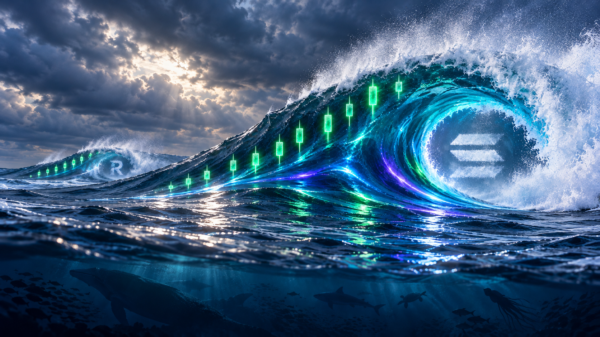
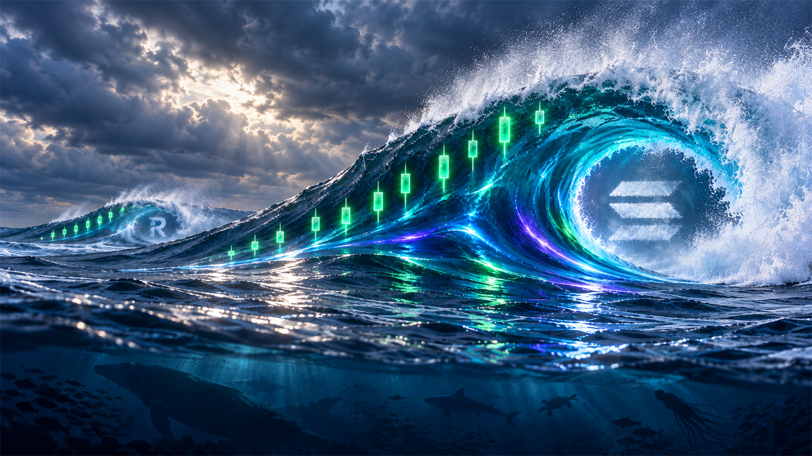
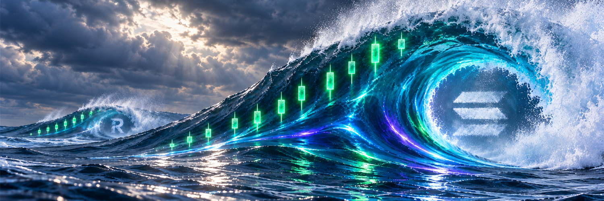

# SOLSWELL V17 — clean-current master (review only)

## What changed

V17 is a fresh generation, not an edit or upscale of a prior banner. It uses a realistic-water reference only for liquid water and spray, and the approved V4 profile only for the SOLSWELL palette. No earlier banner was supplied.

- Restores visible electric green, cyan, and restrained purple through a small number of continuous current ribbons.
- Retains natural deep-blue water, a left-to-right primary swell, supporting RAY swell, rising candle groups, inner three-bar mist mark, and subdued underwater ecosystem.
- Explicitly avoids the prior cellular, polygonal, honeycomb, and electric-web surface treatment.

## Deliverables

- `solswell-master-banner-v17-clean-current.png` — native master, **1672 × 941**.
- `solswell-master-banner-v17-website-hero-1600x900.png` — full-scene website preview, downsampled from master.
- `solswell-master-banner-v17-x-1500x500.png` — 3:1 X-header crop from the master.
- [Exact generation prompt](GENERATION-PROMPT.md).

## Review note

The built-in image generator returned a 1672 × 941 master even though the prompt requested its highest native resolution. This package does not call it 4K and does not include artificial upscaling. It is a review candidate only; approved V4 profile art, prior versions, live website, and X remain unchanged.

