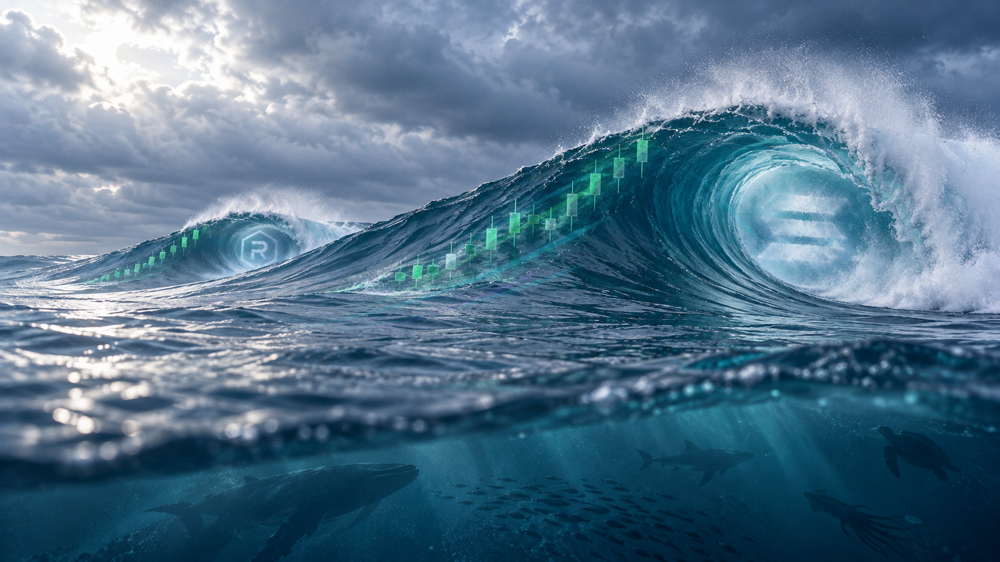

# SOLSWELL non-generative color treatment — energy flow pass

This pass develops the color overlay into the intended story: the ocean represents the community; its energy gathers into the swell and drives the rising candle chart.

## What changed

Smooth, translucent cyan and green bands emerge from the surrounding ocean surface and climb the main swell. They widen and brighten beneath the candle progression, so the current reads as energy building into the wave and pushing the chart. A restrained purple stream and quieter accents echo this flow around the distant RAY swell. The ribbons follow the existing wave contour and avoid the internal symbols.

The treatment was made with deterministic Pillow drawing and alpha compositing. It uses sampled cubic curves, tapered color bands, and soft halos on transparent layers. No image generation, whole-image color grading, blur of the base, sharpening, warping, or resampling was used.

## Files

- `solswell-color-treated-master.png` — treated master at native 1672 × 941.
- `solswell-color-treatment-comparison.png` — original on the left; treatment on the right, both native size.
- `solswell-clean-water-source.png` — exact source copy used as the unmodified base.
- `color_treatment.py` — reproducible treatment.

## Pixel preservation

The source copy matches the original SHA-256 exactly. In the finished composite, **1,501,382 of 1,573,352 pixels are identical** to the source. The remaining 71,970 pixels change only where the translucent ribbons and their soft halos blend in. The water was not regenerated, distorted, or resampled; its original surface detail is retained under those overlays.

Review only. No website, X, profile art, or live assets were changed.

