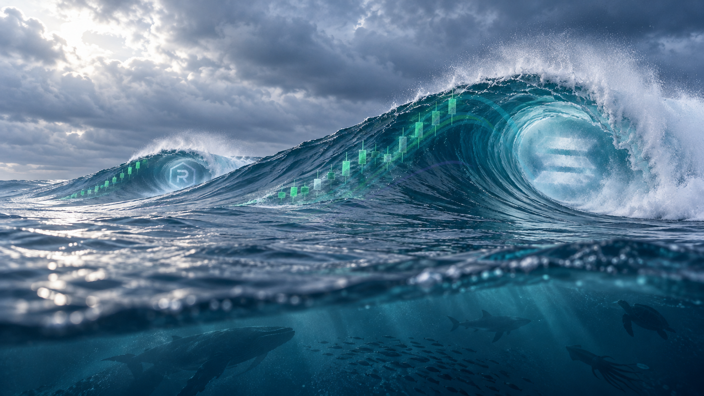

# SOLSWELL color treatment — wave-contour pass

This pass corrects the previous diagonal reading. The translucent cyan, green, and purple currents now sweep up the wave face, round over its shoulder, and curl toward the barrel, following the swell's shape rather than its left-to-right axis. The arcs sit beneath and around the rising candles to suggest the ocean's energy feeding their ascent.

## Files

- `solswell-color-treated-master.png` — treated master, 1672 × 941.
- `solswell-color-treatment-comparison.png` — original on the left; treatment on the right.
- `solswell-clean-water-source.png` — unchanged source copy.
- `color_treatment.py` — reproducible transparent-overlay treatment.

## Preservation

The water scene was not regenerated, warped, or globally color-graded. Only translucent current ribbons and their soft halos are composited; the source file remains unchanged. V2 and V3 are preserved in their own folders.

Review only. No website or X changes were made.
