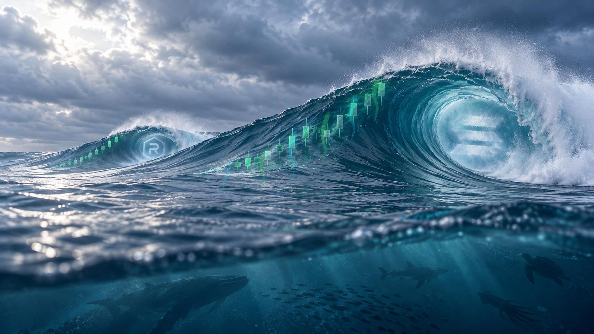

# SOLSWELL color treatment — vertical updraft pass

This pass interprets the wave as a curling tube. Instead of a horizontal ribbon wrapping around it, separate cyan and green currents climb vertically along the outside of the swell, curve with its surface, and stop at successive candles. The intent is to show the ocean's energy lifting the chart from below.

## Files

- `solswell-color-treated-master.png` — treated master, 1672 × 941.
- `solswell-color-treatment-comparison.png` — original on the left; treatment on the right.
- `solswell-clean-water-source.png` — unchanged source copy.
- `color_treatment.py` — reproducible transparent-overlay treatment.

## Preservation

No image generation, warping, or global color grading was used. The source file remains unchanged; only the translucent energy streams and their soft halos are composited over it. Earlier V2, V3, and V4 versions remain preserved in separate folders.

Review only. No website or X changes were made.
