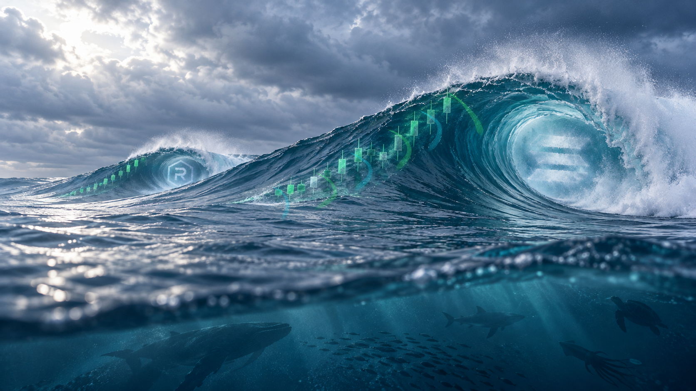

# SOLSWELL color treatment — 3D barrel-wrap pass

This pass anchors each luminous trail at a candle's lower wick. From there it follows the swell's curved outer surface down to the water, making a consistent half-wrap around the barrel rather than a straight vertical or horizontal mark. The lateral bulge and return suggest the near side of a rotating tube in perspective; each path meets the ocean at the swell's base.

## Files

- `solswell-color-treated-master.png` — treated master, 1672 × 941.
- `solswell-color-treatment-comparison.png` — unchanged source on the left; treatment on the right.
- `solswell-clean-water-source.png` — exact source copy.
- `color_treatment.py` — reproducible overlay treatment.

## Preservation

No image generation, warping, or global color grading was used. The water source remains byte-identical; only translucent ribbon and halo pixels change in the treated output. V2 through V5 remain preserved separately.

Review only. No website or X changes were made.
