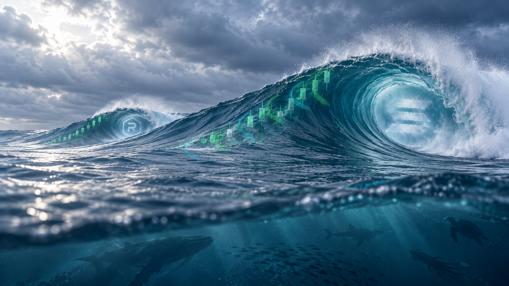

# SOLSWELL color treatment — corrected wrap direction

V7 reverses V6's wrap handedness to match the visible rotation of the swell. Each current starts at a candle's lower wick and travels around the opposite side of the barrel before meeting the water surface. The lateral arcs vary with the wave's turning profile and are intended as a screen-space cue for the 3D wrap.

## Files

- `solswell-color-treated-master.png` — treated master, 1672 × 941.
- `solswell-color-treatment-comparison.png` — unchanged source on the left; treatment on the right.
- `solswell-clean-water-source.png` — exact source copy.
- `color_treatment.py` — reproducible overlay treatment.

The original water scene remains unchanged; only translucent ribbons and their halos are composited. Review only; no website or X changes.
