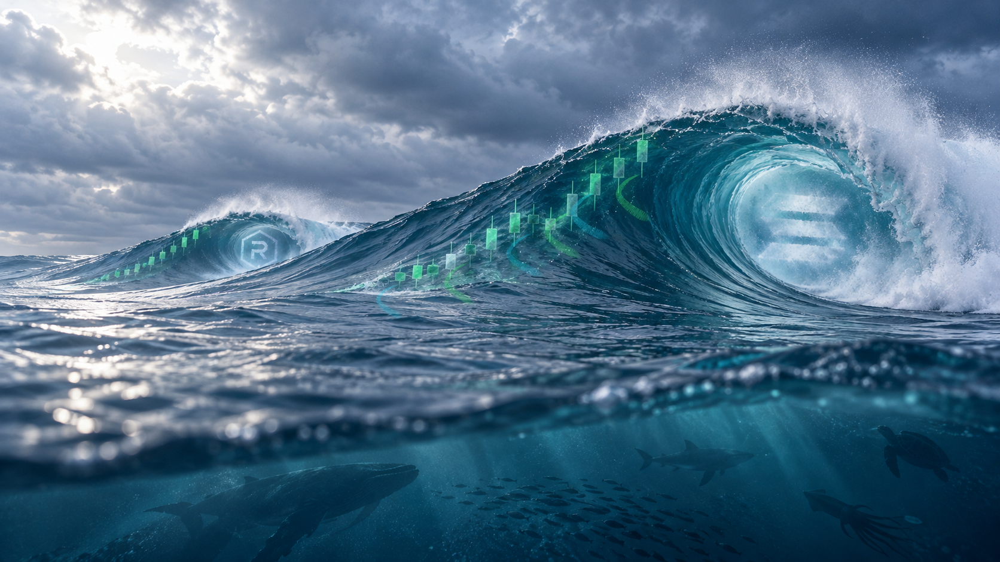

# SOLSWELL color treatment — wick-anchored wrap pass

V8 corrects the starting points: the upper end of each current is placed at the bottom wick of a selected candle. From that exact anchor, each translucent trail follows the corrected wrap direction down the wave's curved outside and meets the surrounding water surface.

## Files

- `solswell-color-treated-master.png` — treated master, 1672 × 941.
- `solswell-color-treatment-comparison.png` — unchanged source on the left; treatment on the right.
- `solswell-clean-water-source.png` — exact source copy.
- `color_treatment.py` — reproducible overlay treatment.

The scene was not regenerated, warped, or globally color-graded. Only translucent current ribbons and their halos are composited; earlier versions remain preserved. Review only; no website or X changes.
